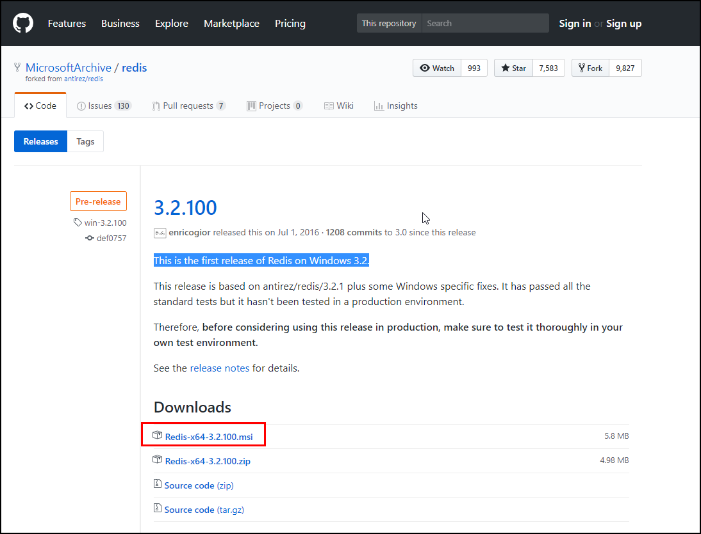
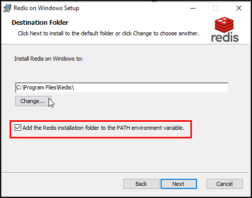
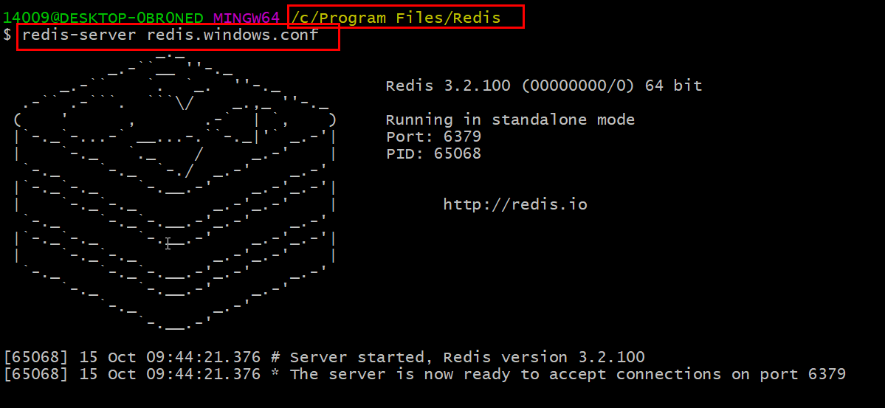
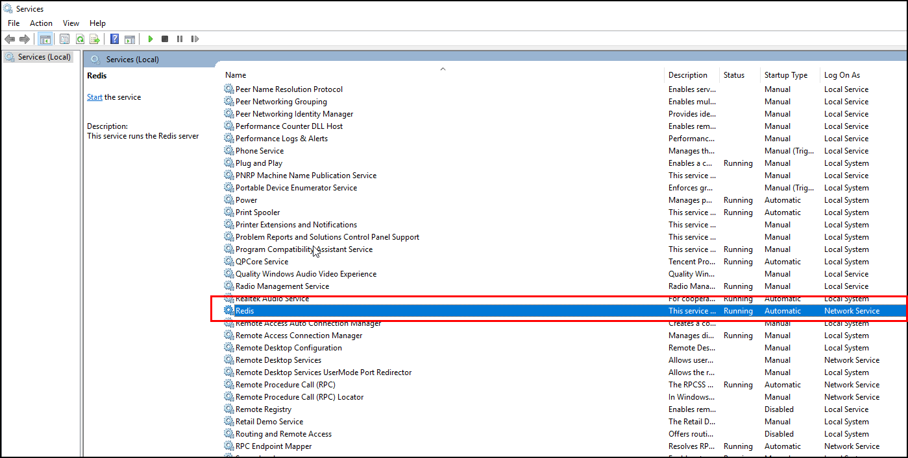

## [redis在windows平台安装和启动](https://www.cnblogs.com/zheting/p/7670076.html)
官网： [https://redis.io/](https://redis.io/)

中文网站：[http://www.redis.net.cn/](http://www.redis.net.cn/)

### 一、下载windows版本的redis
官网没有提供windows版本的下载，只有linux版本，但是在github上提供了windows版本

 [https://github.com/MicrosoftArchive/redis/releases/tag/win-3.2.100](https://github.com/MicrosoftArchive/redis/releases/tag/win-3.2.100)

百度网盘：[http://pan.baidu.com/s/1hsnaF32](http://pan.baidu.com/s/1hsnaF32)

### 二、安装redis
      以msi后缀的文件是windows可执行程序，直接点击安装就可以了，和普通软件的安转么有什么区别。

      注意勾选一下环境变量的创建，如下图所示：

      
### 三、启动redis
 启动命令：redis-server redis.windows.conf

注意：要在redis的安装目录下执行这个命令，因为redis.windows.conf文件在这个目录下，也可以直接运行redis-server启动（此时可以在任何目录下执行，因为上一步勾选了环境变量的创建），使用默认配置。

安装redis以后，在windows服务中会创建Redis的服务，不会因为dos窗口关闭而服务停止。

 命令： redis-server --service-start   启动服务

 命令：redis-server --service-stop    停止服务
 在Windows10中命令窗口输入：services.msc或者在任务管理器中找到【服务】选项卡，打开并找到Redis服务
 
